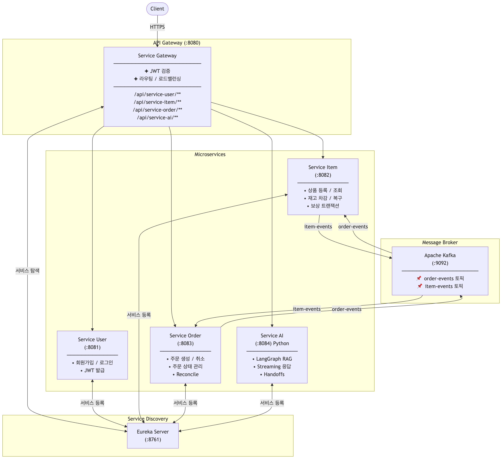

# MSA-example

Spring Boot + Python 기반 마이크로서비스 아키텍처 예제 프로젝트입니다.
주문과 재고 관리를 **Kafka 이벤트 기반 Saga 패턴**으로 구현하고, 장애 시 **보상 트랜잭션**으로 데이터 정합성을 보장합니다.
**LangGraph 기반 AI 서비스**를 Python(FastAPI)으로 구현하여 Eureka에 등록하고 Gateway를 통해 통합합니다.

## 아키텍처



## 서비스 구성

| 서비스 | 포트 | 역할 | 데이터베이스 |
|--------|------|------|-------------|
| **service-discovery** | 8761 | Eureka Server (서비스 레지스트리) | - |
| **service-gateway** | 8080 | API Gateway (JWT 검증, 라우팅) | - |
| **service-user** | 8081 | 회원가입, 로그인, JWT 발급 | H2 |
| **service-item** | 8082 | 상품 등록/조회, 재고 관리 | H2 |
| **service-order** | 8083 | 주문 생성/취소, 상태 관리 | H2 |
| **service-ai** | 8084 | LangGraph RAG 채팅, 스트리밍, Handoffs | PostgreSQL |
| **kafka** | 9092 | 메시지 브로커 | - |

## 주문 흐름 (Saga Pattern)

### 정상 주문

```
Client → POST /buy(itemId=3)
  → OrderService: 주문 생성 (PENDING)
  → [order-events] OrderCreatedEvent 발행
  → ItemService: 재고 차감
  → [item-events] StockDecreasedEvent 발행
  → OrderService: 주문 상태 → COMPLETED
```

### 정상 취소

```
Client → POST /cancel(orderId=1)
  → OrderService: 주문 상태 → CANCELLING
  → [order-events] OrderCancelledEvent 발행
  → ItemService: 재고 복구
  → [item-events] StockIncreasedEvent 발행
  → OrderService: 주문 상태 → CANCELLED
```

## 보상 트랜잭션 (Compensating Transaction)

Kafka Consumer에서 3회 재시도 후에도 실패하면, recovery callback에서 보상 이벤트를 발행하여 데이터 정합성을 자동 복구합니다.

### Scenario 1: 재고 차감 성공 → 주문 COMPLETED 업데이트 실패

```
StockDecreasedEvent → OrderService DB 에러 → 3회 재시도 실패
  → CompensateStockDecreaseEvent 발행
  → ItemService: 재고 복구
  → StockDecreaseFailedEvent 발행
  → OrderService: 주문 → FAILED
```

### Scenario 2: 재고 복구 성공 → 주문 CANCELLED 업데이트 실패

```
StockIncreasedEvent → OrderService DB 에러 → 3회 재시도 실패
  → 로그 경고 (재고는 이미 안전한 상태)
  → Reconciliation Scheduler가 CANCELLING 상태 주문 감지 후 재처리
```

### Scenario 3: 주문 생성 이벤트 → ItemService 처리 실패

```
OrderCreatedEvent → ItemService DB 에러 → 3회 재시도 실패
  → OrderProcessingFailedEvent 발행
  → OrderService: 주문 → FAILED
```

### Scenario 4: 주문 취소 이벤트 → ItemService 처리 실패

```
OrderCancelledEvent → ItemService DB 에러 → 3회 재시도 실패
  → CancelProcessingFailedEvent 발행
  → OrderService: 주문 → CANCEL_FAILED
```

### 안전망: Reconciliation Scheduler

보상 이벤트 발행 자체가 실패하는 최악의 경우를 대비한 안전망입니다.

- **5분 주기**로 실행
- **10분 이상** PENDING/CANCELLING 상태인 주문 감지
- 해당 주문의 이벤트를 재발행하여 Saga 흐름 재시작
- 멱등성 처리(`ProcessedEvent`)로 중복 실행 방지

## 데이터 정합성 보장 메커니즘

```
1차: Kafka Retry (1초 간격, 3회)
  ↓ 실패
2차: 보상 이벤트 발행 (자동 복구)
  ↓ 실패
3차: Reconciliation Scheduler (5분 주기, 10분 이상 체류 감지)
```

| 메커니즘 | 설명 |
|---------|------|
| **이벤트 멱등성** | `ProcessedEvent` 테이블로 중복 처리 방지 |
| **비관적 잠금** | `SELECT FOR UPDATE`로 재고 동시성 제어 |
| **보상 트랜잭션** | retry 소진 시 보상 이벤트로 자동 롤백 |
| **Reconciliation** | Scheduler가 장기 체류 주문을 주기적으로 재처리 |

## 인증 흐름

```
1. POST /api/service-user/register  →  회원가입
2. POST /api/service-user/login     →  JWT를 HttpOnly Cookie로 발급
3. 이후 요청 시 Gateway가 Cookie에서 JWT 검증
4. 검증 성공 → X-User-Id 헤더 추가 후 서비스로 라우팅
```

## 실행 방법

### 1. Kafka 실행

```bash
docker-compose up -d
```

### 2. 서비스 실행 (순서대로)

```bash
# 1) Eureka Server
cd service-discovery && ./gradlew bootRun

# 2) Gateway
cd service-gateway && ./gradlew bootRun

# 3) User / Item / Order / AI (순서 무관)
cd service-user && ./gradlew bootRun
cd service-item && ./gradlew bootRun
cd service-order && ./gradlew bootRun
cd service-ai && uv run uvicorn app.main:app --host 0.0.0.0 --port 8084
```

### 3. API 테스트

```bash
# 회원가입
curl -X POST "http://localhost:8080/api/service-user/register" \
  -H "Content-Type: application/json" \
  -d '{"id": "user1", "pwd": "1234"}'

# 로그인
curl -c cookies.txt -X POST "http://localhost:8080/api/service-user/login" \
  -H "Content-Type: application/json" \
  -d '{"id": "user1", "pwd": "1234"}'

# 상품 등록
curl -b cookies.txt -X POST "http://localhost:8080/api/service-item/register" \
  -H "Content-Type: application/json" \
  -d '{"name": "테스트상품", "price": 10000, "quantity": 100}'

# 주문
curl -b cookies.txt -X POST "http://localhost:8080/api/service-order/buy?item_id=1"

# 주문 조회
curl -b cookies.txt "http://localhost:8080/api/service-order/search"

# 주문 취소
curl -b cookies.txt -X POST "http://localhost:8080/api/service-order/cancel?order_id=1"

# AI 채팅
curl -b cookies.txt -X POST "http://localhost:8080/api/service-ai/v1/chat" \
  -H "Content-Type: application/json" \
  -d '{"message": "안녕하세요"}'
```

## 기술 스택

- **Java 17**, **Spring Boot 3.5**
- **Spring Cloud** — Gateway, Eureka
- **Apache Kafka** — 이벤트 기반 비동기 통신
- **Spring Data JPA** + **H2** — 데이터 접근
- **Auth0 java-jwt** — JWT 인증
- **Python 3.12**, **FastAPI** — AI 서비스
- **LangGraph** + **LangChain** — RAG, Multi-Agent Handoffs
- **py-eureka-client** — Python 서비스 Eureka 등록
- **Gradle** / **uv** — 빌드 도구
- **Docker Compose** — Kafka 인프라
